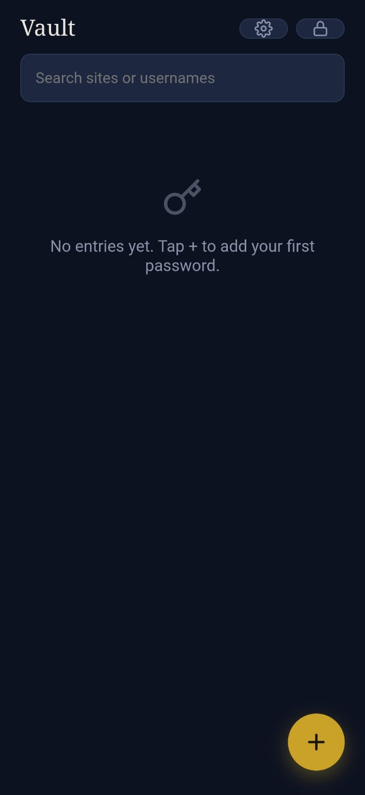
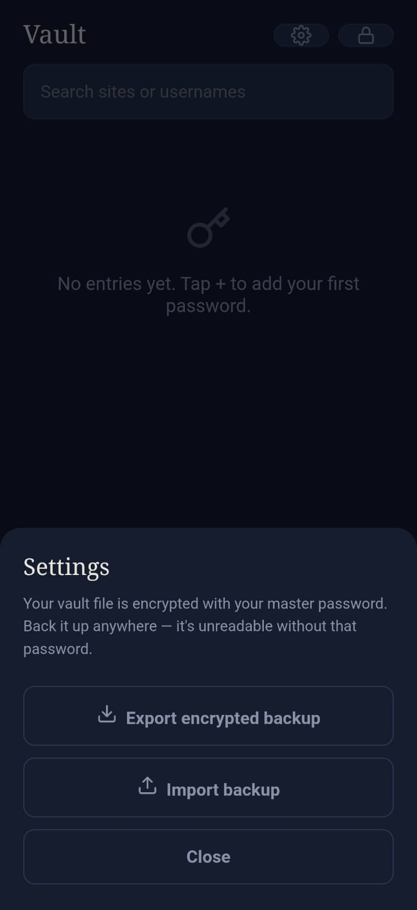
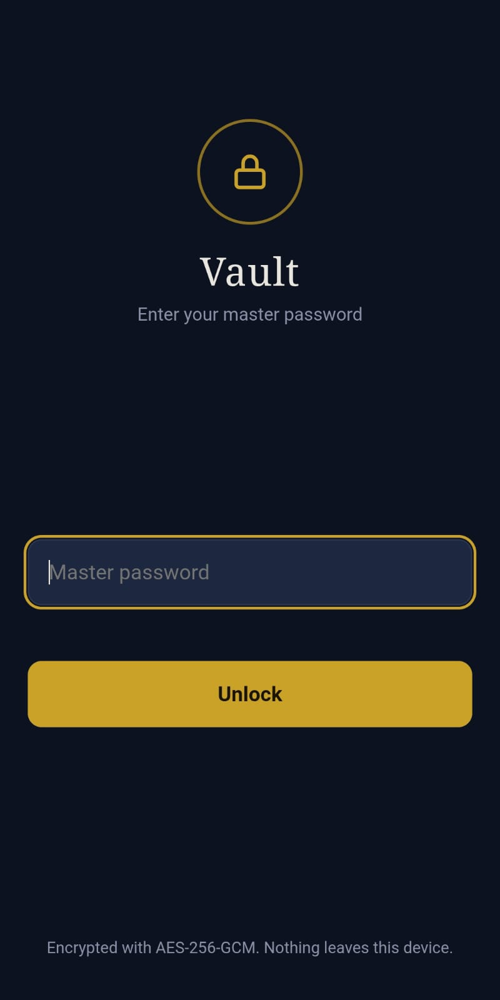
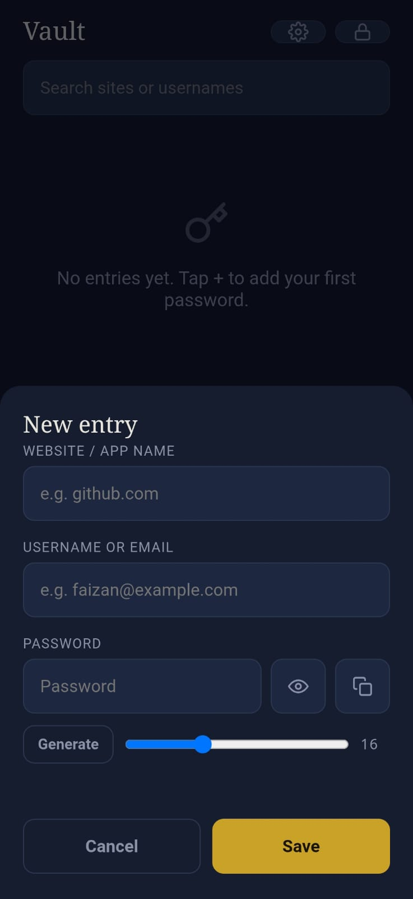

# 🔐 Secure Password Vault

A lightweight, offline password manager for Android built with Capacitor and Android Studio. Secure Password Vault allows users to safely store website credentials behind a master password while keeping all data stored locally on the device.


---

## 📱 Screenshots

| Vault | Settings |
|---|---|
|  |  |

| Login | Add Entry |
|---|---|
|  |  |

---

## ✨ Features

- 🔐 Master password authentication
- 📝 Store multiple website/app credentials
- 👤 Save usernames or email addresses
- 🔑 Secure password storage
- 🎲 Built-in password generator
- 👁 Show/hide password visibility
- 📋 One-click password copy
- 🔎 Search saved credentials
- 💾 Export encrypted backups
- 📥 Import encrypted backups
- 📱 Fully offline operation
- 🌙 Modern dark-themed interface

---

## 🛠 Technologies Used

- Capacitor
- Android Studio
- JavaScript
- HTML5
- CSS3
- Android SDK

---

## 🚀 Installation

Clone the repository:

```bash
git clone https://github.com/faizi-cybsec/secure-password-vault.git
```

Install dependencies:

```bash
npm install
```

Sync Capacitor:

```bash
npx cap sync
```

Open Android project:

```bash
npx cap open android
```

Build and run using Android Studio.

---

## 🔒 Security

This application is designed as an offline password vault:

- All passwords remain on the user's device.
- Access requires a master password.
- Backup files are encrypted.
- No cloud synchronization.
- No external servers are used.

---

## 📋 Future Improvements

- Biometric authentication
- Password strength meter
- Auto-lock functionality
- Categories and tags
- Password breach checking
- Secure notes
- Backup to cloud storage

---

## 👨‍💻 Author

**Faizan Ahmed**

- GitHub: https://github.com/faizi-cybsec

---

## 📄 License

This project is licensed under the MIT License.
